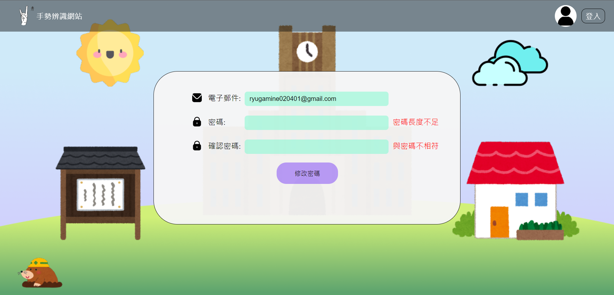
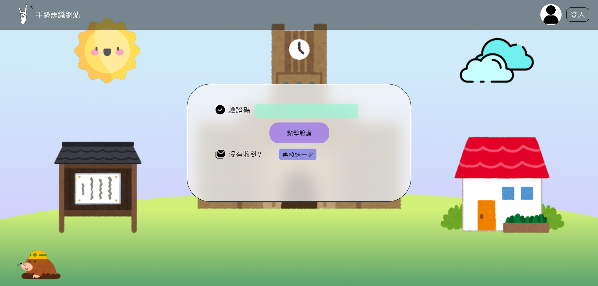
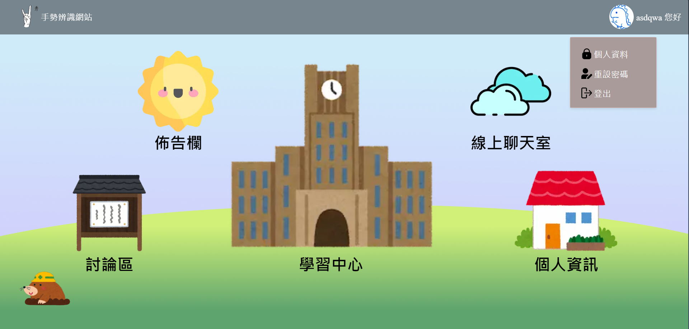
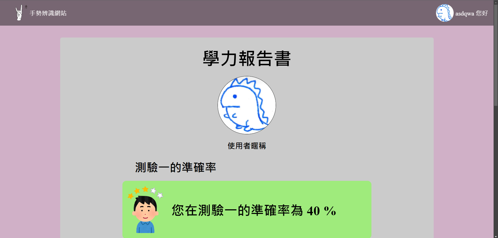
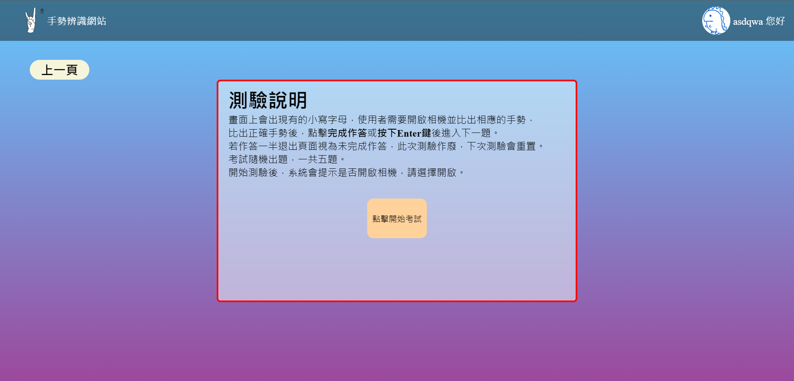
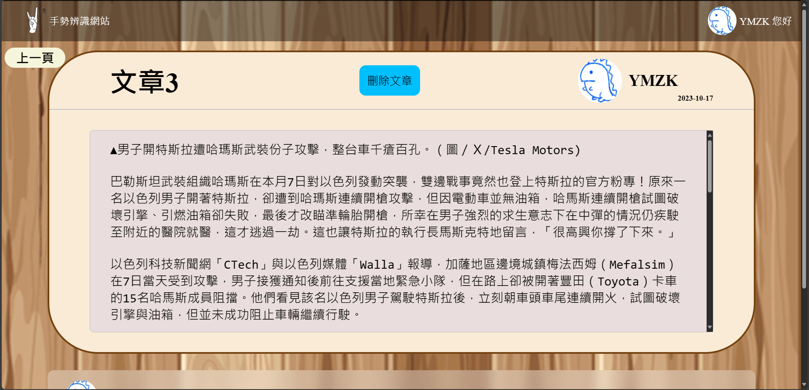

# 專案簡介
```
    根據世界聾人聯合會的統計指出，世界上約有7000萬
    聽障人士，而其中又有大約5600萬人沒有機會接受任何教育。
    而隨著時代的改變，現代人有了更多的管道及資源可以自我學習，
    因此我們想要完成一個可以學習基本手語手勢的網站，且透過較為
    有趣的方式引導、吸引各種人學習，進而激發出人們對手語的了解
    並達成引人入勝的效果。
```
# 開啟專案方式
**開發環境版本**
* Ucuntu20.04
* Python 3.8.10
* npm 10.2.0
* node v18.17.1
* MySQL 8.0.34-0ubuntu0.20.04.1 for Linux on x86_64 ((Ubuntu))
... 詳細套件內容至前後端目錄底下[開發環境]()查看
## 透過Docker
先下載相對應的image
1. 先建立一個自己的Docker網路
    ```
    sudo docker network create --driver backend-net 
    ```
    > backend-net 可替換成自己設定的網路名稱

2. 啟動MySQL的容器
    * 拉取官方的images
        ```
        sudo docker pull mysql:8.0.34
        ```
    * 容器啟動
        ```
        docker run -d -p <本機 port>:3306 --name <contianer name> -e MYSQL_ROOT_PASSWORD='your_password' mysql:8.0.34
        ```
    > 可以直接在這邊加入 --network
    * 進入容器
        ```
        sudo docker exec -it <container name> bash
        ```
    * 設定相關database資料
        ```
        mysql -u root -p
        ```
        > 需要輸入剛剛開啟容器的密碼
    * 連接剛剛建立的網路
        ```
        sudo docker network connect <net name> <contianer name>
        ```
        > 如果啟動容器已經加入過就不用了
3. 啟動後端的容器
    * 先在本地建立images
        ```
        sudo docker build -t django .
        ```
        > 需要設定好.env
    * 啟動容器
        ```
        sudo docker run -it -p <host port>:8000 django --net backend-net
        ```
        > 檢查看有沒有正常開啟
4. 啟動phpmyadmin容器
    ```
    sudo docker run --name phpmyadmin -it --link <contianer name>:db -p <host port>:80 phpmyadmin
    ```
    > 不用加入相同的後端網路就可以，只要設定好mysql容器的名稱
5. 設定nginx
    * 更新
        ```
        sudo apt update
        ```
    * 安裝nginx
        ```
        sudo apt install nginx
        ```
    * 前往安裝路徑
        ```
        cd /etc/nginx/conf.d
        ```
    * 建立一個存放SSL憑證的地方
        ```
        mkdir SSL
        ```
    * 建立設定檔
        ```
        sudo nano default.conf
        ```
* 根據需求使用以下格式設定

```nginx=
upstream backend {
    server localhost:<your backend port>;
}
upstream frontend {
    server localhost:<your frontend port>;
}

server {
    listen <your nginx port> ssl;
    listen [::]:<your nginx port> ssl;
    server_name <server domain name>;

    ssl_certificate /etc/nginx/conf.d/SSL/nginx-selfsigned.crt;
    ssl_certificate_key /etc/nginx/conf.d/SSL/nginx-selfsigned.key;
    
    location /api {
        proxy_pass http://backend;
        proxy_set_header Host $http_host;
        proxy_set_header X-Real-IP $remote_addr;
        proxy_set_header X-Forwarded-For $proxy_add_x_forwarded_for;
        proxy_http_version 1.1; 
    }

    location /ws {
        proxy_pass http://backend;
        proxy_http_version 1.1;
        proxy_set_header Host $host;
        proxy_set_header X-Real-Ip $remote_addr;
        proxy_set_header X-Forwarded-For $proxy_add_x_forwarded_for;
        proxy_set_header X-Nginx-Proxy true;
        proxy_redirect off;
        client_max_body_size 10m;

        proxy_set_header Upgrade $http_upgrade;
        proxy_set_header Connection "upgrade";
        proxy_connect_timeout 300s;
        proxy_read_timeout 300s;
        proxy_send_timeout 300s;
        
        proxy_set_header X-Real-IP $remote_addr;
        proxy_cache_bypass $http_upgrade;
    }

    gzip on;
    gzip_proxied any;
    gzip_types application/javascript application/x-javascript text/css text/javascript;
    gzip_comp_level 5;
    gzip_buffers 16 8k;
    gzip_min_length 256; 
    location / {
        proxy_pass http://frontend; 
        proxy_http_version 1.1;
        proxy_set_header Upgrade $http_upgrade;
        proxy_set_header Connection "upgrade";
        proxy_set_header X-Real-IP $remote_addr;
        proxy_cache_bypass $http_upgrade;
        proxy_set_header X-Forwarded-Proto https;
        proxy_redirect http:// https://;
    }
}

```
6. 安裝redis
待補...


# 畫面預覽
## 未登入






## 已登入









> 討論區、線上聊天室都有可以查看其他使用者個人字卡的功能


## 管理員才有的頁面



## 前端
1. 進入 **前端** 目錄
```
cd frontend
```
2. 安裝相關套件
```
npm install
```
> 待安裝完成後再進行下一步
3. 設定 `.env.local`
```
NGINX_DOMAIN_IP=nginx的ip 處理next.config.js用的
NEXT_PUBLIC_BACKEND_URL=    nginx開的port/api(根據後端路由方式)
NEXT_PUBLIC_FRONTED_URL=    nginx開的port 前端
```
4. 設定完成後 即可開啟伺服器
```
npm run dev
```
## 後端
1. 進入 **後端** 目錄
```
cd backend
```
2. 進入虛擬環境 *注:以下操作都需要在虛擬環境內*
```
pipenv shell
```
> 進入成功後
3. 安裝相關套件
```
pipenv install
```
> 待安裝完成後
4. 建立 `.env` 
```
EMAIL_HOST_USER = example@yahoo.com 用於寄送驗證信
ROOT_EMAIL = example@yahoo.com   用於驗證管理員全縣
EMAIL_HOST_PASSWORD=paasword1
DB_NAME=data
DB_PASSWORD=paasword2
DB_PORT=8006
SECRET_KEY=secreatkey
JWT_ACCRSS_TOKEN_KEY=secreatkey2
JWT_REFRESH_TOKEN_KEY=secreatkey3
DEBUG=True or FALSE
NGINX_DOMAIN=nginx的domain
```
5. 設定完成後即可開啟伺服器
```
python manager.py runserver
```
> 初次開啟專案，需要migrate，注意database的設定
> ```
> python manager.py migrate
> ```
## ngnix
**nginx version: nginx/1.18.0 (Ubuntu)**
1. 前往安裝目錄 
```
cd /etc/nginx/conf.d
```
2. 透過任意方式填寫文件，這邊用nano作為範例。
```
sudo nano default.conf
```
3. 相關設定參考如下

```
upstream backend {
    server 127.0.0.1:8000;
}
upstream frontend {
    server localhost:3000;
}

server {
    listen <your nginx port>;
    listen [::]:<your nginx port>;
    server_name <your sever name>;

    location /api {
        proxy_pass http://backend;
        proxy_set_header Host $http_host;
        proxy_set_header X-Real-IP $remote_addr;
        proxy_set_header X-Forwarded-For $proxy_add_x_forwarded_for;
        proxy_http_version 1.1;
        
    }

    location /ws {
        proxy_pass http://backend;
        proxy_http_version 1.1;
        proxy_set_header Host $host;
        proxy_set_header X-Real-Ip $remote_addr;
        proxy_set_header X-Forwarded-For $proxy_add_x_forwarded_for;
        proxy_set_header X-Nginx-Proxy true;
        proxy_redirect off;
        client_max_body_size 10m;

        proxy_set_header Upgrade $http_upgrade;
        proxy_set_header Connection "upgrade";
        proxy_connect_timeout 300s;
        proxy_read_timeout 300s;
        proxy_send_timeout 300s;
        
        proxy_set_header X-Real-IP $remote_addr;
        proxy_cache_bypass $http_upgrade;
    }

    gzip on;
    gzip_proxied any;
    gzip_types application/javascript application/x-javascript text/css text/javascript;
    gzip_comp_level 5;
    gzip_buffers 16 8k;
    gzip_min_length 256; 

    location / {
        proxy_pass http://frontend; 
        proxy_http_version 1.1;
        proxy_set_header Upgrade $http_upgrade;
        proxy_set_header Connection "upgrade";
        proxy_set_header X-Real-IP $remote_addr;
        proxy_cache_bypass $http_upgrade;
    }
}

```

# 專案相關圖表

## 心智圖

## 流程圖

## 架構圖

# 完成項目
- [x] 後端 API 設計(Python Django)
- [x] 資料庫(MySQL)
- [x] 前端基本功能 (Nest js)
- [x] nginx http 基本設定
- [x] 網頁基本外觀

# 未完成項目

- [ ] Docker
- [ ] SSL
- [ ] 部屬上雲端
- [ ] RWD
- [ ] 後端 API 文件

# 完整流程紀錄
* [專題歷程](https://hackmd.io/@YMZK/BkZqmiObj/%2FlrH6vsArQdWQe2UxsDDXyw)
* [工具筆記](https://hackmd.io/@YMZK/HJK8hTWpj/%2Fd5ZJEJ7HTBu4kX2wzZVUYQ)